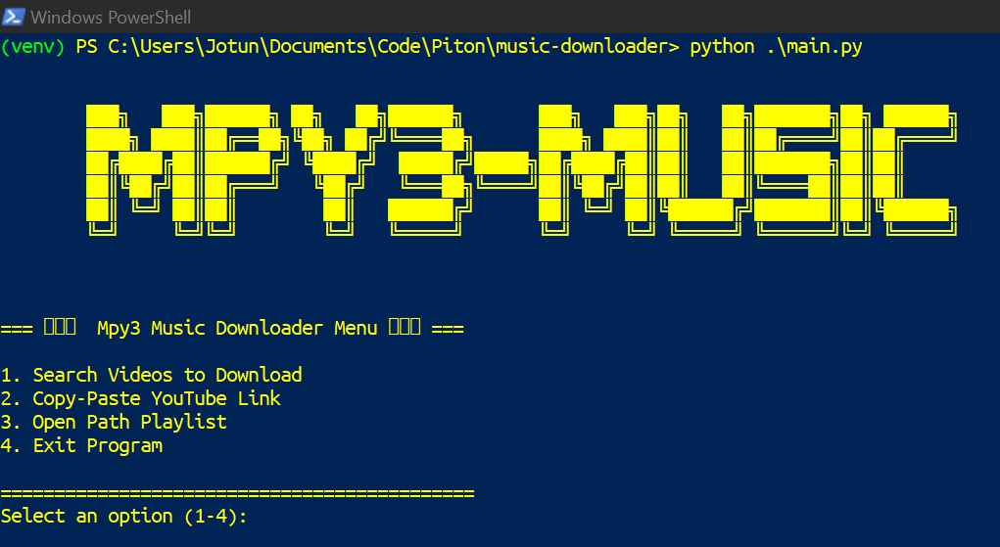

# MPY3-MUSIC
---


Excellent Youtube to MP3 Downloader without ADS!! 
Just Copy-Paste or Search Your Desired Music Video to Download

<br />

You can even organize on your local playlist 😎

<br />

## Pre-Requisites

You need to get your own Youtube API from Google Cloud

> [!tip]
> [How to Get Youtube API](https://www.youtube.com/watch?v=LLAZUTbc97I) 

Adjust the API on `mpy3.py`

```python
python -m venv venv
```

```python
pip install -r requirements.txt
```

Install [FFmpeg](https://www.ffmpeg.org/download.html) for Dependencies

```bash
# for debian based
sudo apt install ffmpeg -y
```

```powershell
# for windows
choco install ffmpeg
``` 

<br />

## Usage

> [!note]
> `Run on virtual env (recommended)`

```bash
.\venv\Scripts\activate
```

```python
python main.py
```


